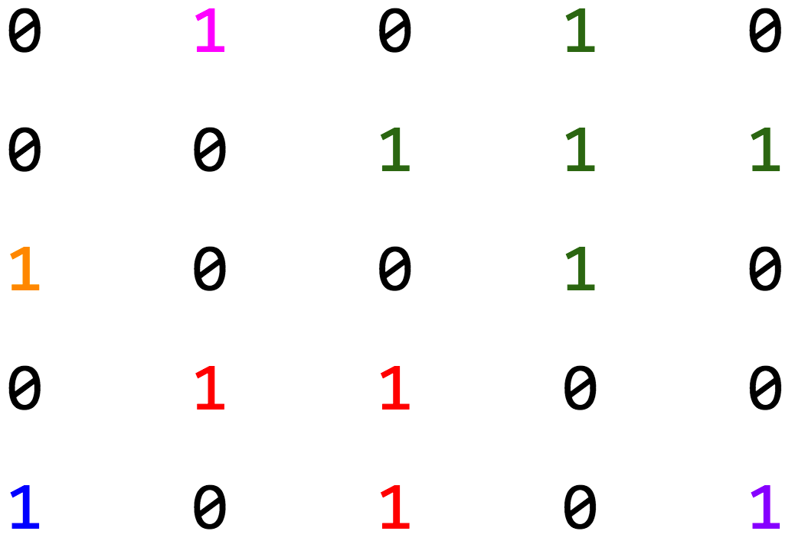

# Number of Islands

## Interviewer Prompt

Given a 2D array of `1`s (land) and `0`s (water), implement a function numIslands count the number of islands. An island is surrounded by water and is formed by connecting adjacent lands horizontally or vertically. You may assume all four edges of the grid are all surrounded by water.



## Example Output

Example 1:
```javascript
const grid = [
  [1, 1, 1, 1, 0],
  [1, 1, 0, 1, 0],
  [1, 1, 0, 0, 0],
  [0, 0, 0, 0, 0],
];

console.log(numIslands(grid));    // 1
```

Example 2:
```javascript
const grid = [
  [1, 1, 0, 0, 0],
  [1, 1, 0, 0, 0],
  [0, 0, 1, 0, 0],
  [0, 0, 0, 1, 1],
];

console.log(numIslands(grid));    // 3
```

## Interviewer Guide

<!-- This guide will walk you through three approaches. The interviewee will probably get the naive method very quickly, which makes two recursive calls. Here, focus on the 'O' of REACTO by explaining that optimization is important for this problem, since for large values of `n`, the naive implementation may run very slowly (and/or the stack may overflow). Point out that a lot of work is being repeated (for example, `getNthFib(10)` will call `getNthFib(9)` and `getNthFib(8)` - while it is calculating `getNthFib(9)`, the engine will need to calculate `getNthFib(8)` and `getNthFib(7)`... so already you can see some overlaps). Ask the interviewee if he/she is familiar with memoization: https://en.wikipedia.org/wiki/Memoization.

Note that different people can have a different understanding of where the Fibonacci begins. (Is the 'first' Fibonacci number 0 or 1? Does n start at 0 or 1?) For our purposes, `getNthFib(1)` = 0, and `getNthFib(2)` = 1. All remaining values can be derived from those two. The user should not be feeding in values of `n` that are less than 1, such as 0. -->

### RE

<!-- At this point the interviewee should be asking you questions to clarify the problem statement. If they are not, prompt them: _"Do you have any questions before we get started?"_ Some questions you may get:
  - _What are my base inputs?_ 1 and 2.
  - _How big could n be?_ Potentially very large - that's why optimization matters!
  - _Can my input ever be non-positive or non-integer?_ No, do not worry about this case.

The interviewee should also be writing out the first few Fibonacci numbers, along with their `n` values. Check this against the Example Output above to make sure you're on the same page. -->

### AC

<!-- As stated above, most interviewees will probably go straight to the naive solution. Even if your interviewee does not, make sure to ask about it to ensure that he/she understands it. Try to get through this within the first 10 minutes, so there is time for you to walk your interviewee through memoization. -->

### TO

<!-- With the naive solution having been explored, make sure your interviewee understands why this implementation would be slow for large numbers of `n`. For example, if you try `getNthFib(100)` it will probably get your Chrome dev tools to stop responding... -->

### Answers to Common Questions

<!-- N/A -->

## Solution and Explanation

<!-- This problem is often used as an introduction to recursion. By our base definitions, `getNthFib(1)` = 0, `getNthFib(2)` = 1, and for any other value of `n`, `getNthFib(n)` = `getNthFib(n - 1)` + `getNthFib(n - 2)`.

Therefore, the naive implementation is simple: -->

### Solution Code

<!-- ```javascript
function getNthFib(n) {
  if (n === 1) return 0;
  if (n === 2) return 1;
  return getNthFib(n - 1) + getNthFib(n - 2);
}
``` -->

## Summary

<!-- - Optimization is important. While it will not necessarily be the largest focus in REACTO going forward, I chose the classic Fibonacci problem to showcase the variety of ways to approach it, to introduce the concept of memoization, and to demonstrate that sometimes iteration can be more efficient than recursion (to avoid blowing up the call stack)!

- Trivia: Did you know that this problem can technically be solved in constant time and constant space using Binet's formula? (See https://en.wikipedia.org/wiki/Fibonacci_number#Binet's_formula)

```
F(n) = (phi^n - psi^n) / sqrt(5)

where phi = (1 + sqrt(5))/2 and psi = -1/phi.
``` -->

## Credits

- This .md was a collaboration between Jing Cao (github.com/peoplemakeculture) and Stanley So (github.com/stanley-c-so)

## References

- Problem adapted from LeetCode #200 (medium): https://leetcode.com/problems/number-of-islands/